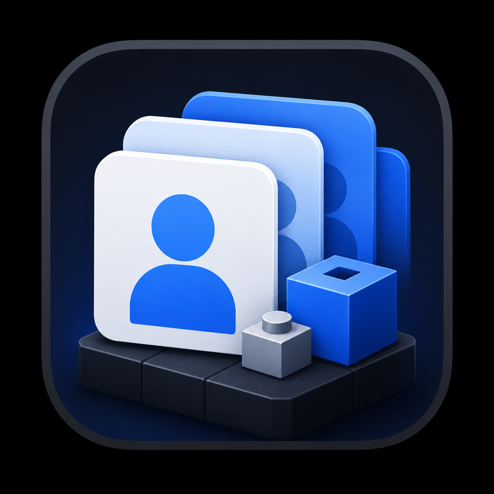

# MultiInstanceRoblox

Native macOS utility for managing multiple Roblox profiles on Apple Silicon Macs.



The app creates a separate managed copy of the installed Roblox app per profile, keeps a separate WebKit login session per profile, and routes `roblox:` / `roblox-player:` launch URLs to the selected profile copy.

It does not store Roblox passwords, automate gameplay, patch the original `/Applications/Roblox.app`, or attempt to bypass Roblox platform checks.

## Build

```sh
swift build -c release
./Scripts/package_app.sh
open dist/MultiInstanceRoblox.app
```

## Runtime Data

Profiles and managed Roblox copies are stored at:

```text
~/Library/Application Support/MultiInstanceRoblox/
```

Each profile has its own:

- Persistent WebKit data store UUID.
- Managed Roblox copy.
- Profile metadata JSON.

If Roblox updates, the app detects the source version mismatch and offers to repair/rebuild the profile copy.

## Features

- Multiple profiles with separate Roblox web sessions.
- Per-profile managed Roblox copies.
- Profile rename, duplicate, color, icon, notes, search, and reorder.
- Bulk profile selection for launching and repair actions.
- Paste URL/search launcher.
- Favorites and recent URLs per profile.
- Repair all, stop all, clone health details, and diagnostics export.
- Running process CPU/RAM display.
- Best-effort Roblox window arrangement: grid, columns, rows, and cascade.
- Per-profile session clearing.

## URL Launching

Roblox web game URLs usually need the logged-in browser session to generate a session-specific `roblox-player:` URL. Because of that:

- `roblox:` and `roblox-player:` URLs can be launched directly across selected profiles.
- Normal `https://www.roblox.com/...` URLs are queued into each selected profile browser; select each profile and press Play from that logged-in Roblox page.

## Window Arrangement

Window arrangement uses macOS Accessibility automation through System Events. If it does not move Roblox windows, allow the app or Terminal/Codex host in:

```text
System Settings -> Privacy & Security -> Accessibility
```

## Recovery and repairs

If `profiles.json` cannot be read, the app preserves it and shows recovery options.
You can restore `profiles.backup.json` or start fresh. Both actions first keep a
separate `profiles.unreadable-<UUID>.json` copy of the original file. The backup
contains the previous successfully saved profile metadata, not a copy of browser
sessions or Roblox apps.

Repairs copy Roblox into a temporary folder, patch and sign that copy, and verify
it before replacing the existing profile copy. If installing the replacement
fails, the app attempts to restore the old copy. Stop a running profile before
repairing or deleting it. Preparation and process checks run off the UI thread,
and a profile accepts only one launch, repair, or data-cleanup operation at a time.

The manager checks the installed Roblox version every three seconds, reconnects
to already running managed copies when opened, and tracks Stop requests until
the processes actually exit. Launching a running profile routes the link to its
existing app instance.

## Browser and profile controls

Use Back, Forward, Reload, and Home above the browser. Opening the same URL again
navigates again. Page failures show a Retry button. Web pages are saved in Recent;
native launch links are not added to history because they are session-specific.

The profile-details button opens the inspector for names, icons, colors, notes,
clone health, repair, session clearing, and deletion. The menu beside the launcher
contains bulk repair, Stop All, window arrangements, and diagnostics export.
Reordering is disabled while filtering profiles to avoid moving unrelated rows.
Deleting a profile removes its cached browser, persistent WebKit store, and managed
Roblox copy. If cleanup fails, the profile stays available so deletion can be retried.

## Tests

```sh
swift test
```

Regression tests use temporary directories and browser doubles. They cover corrupt
profile recovery, backup restoration, preservation of edits during repair, safe
replacement and rollback, launch decisions, installed-version refresh, URL parsing,
repeated navigation, and browser-cache cleanup. They do not launch Roblox or use
saved accounts.

For an isolated UI check, debug builds support:

```sh
swift run MultiInstanceRoblox --preview
```

Preview uses new temporary profiles, nonpersistent browser sessions, and a blank
home page. The flag is available only in debug builds. Live sign-in, game launches,
and Accessibility window arrangement still need manual checks on a Mac.
